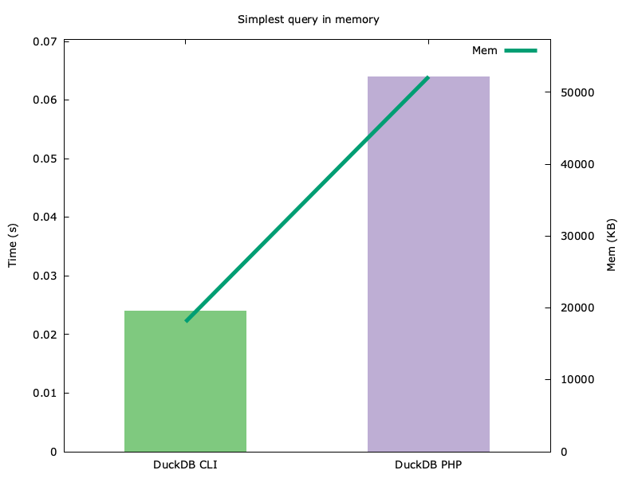
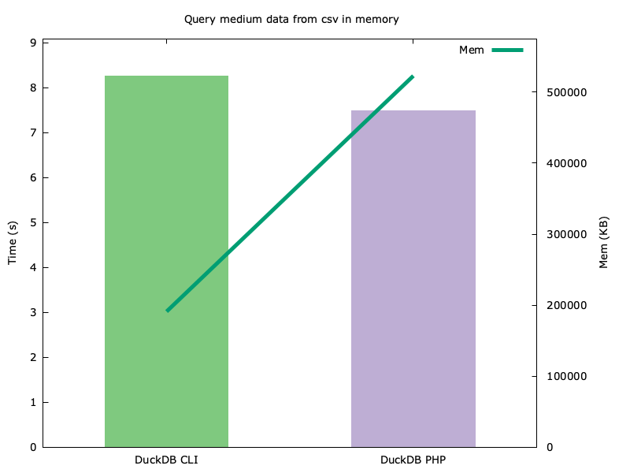
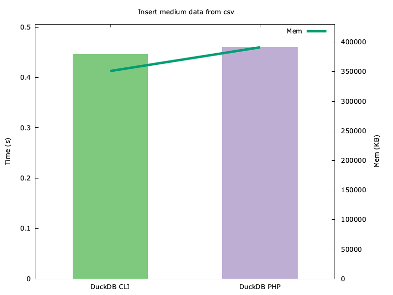
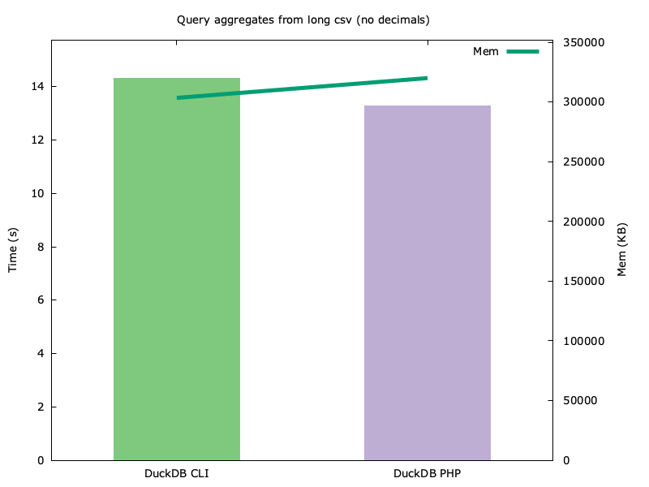
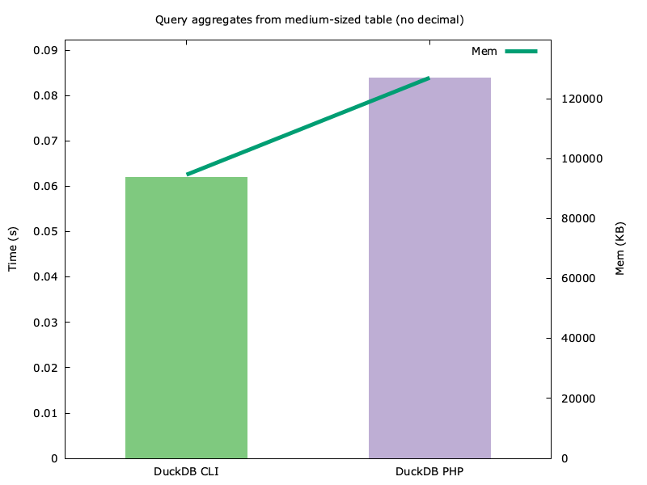
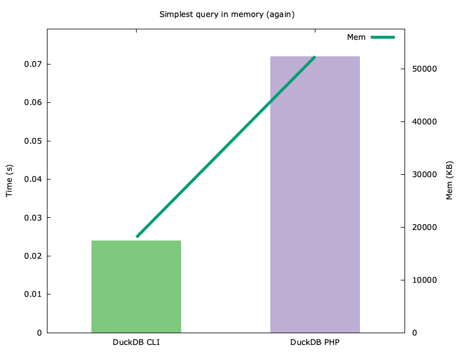
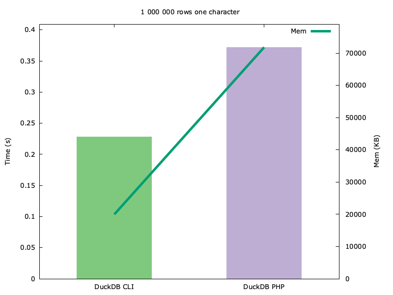
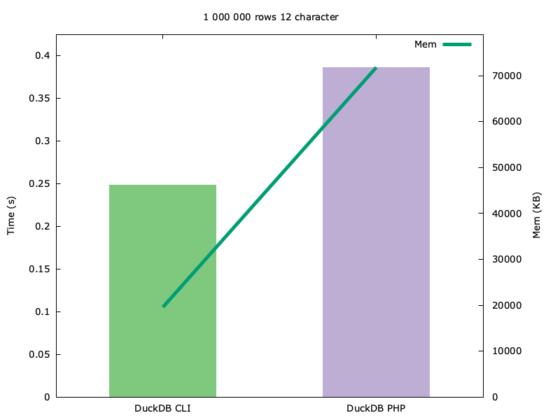
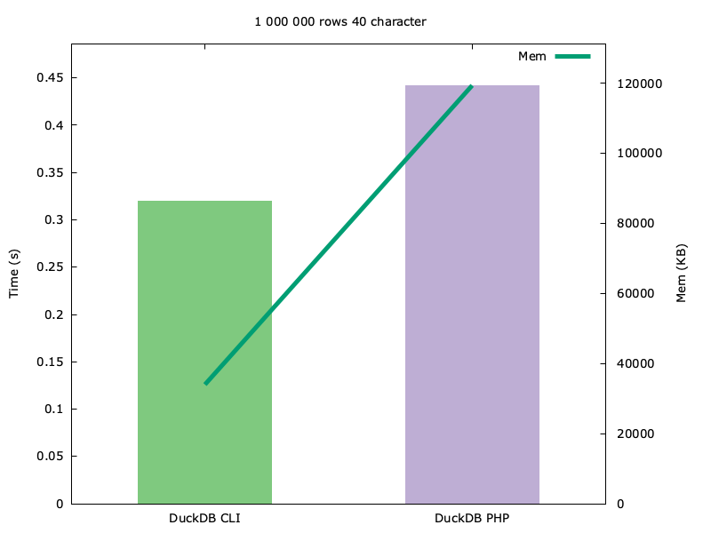

# Benchmarking results

These are some results obtained in a local machine with this hardware:

```
    Hardware Overview:

      Model Name: MacBook Pro
      Model Identifier: Mac15,7
      Model Number: MRW13Y/A
      Chip: Apple M3 Pro
      Total Number of Cores: 12 (6 performance and 6 efficiency)
      Memory: 18 GB
      System Firmware Version: 11881.81.4
      OS Loader Version: 11881.81.4
```

They were generated using the following commands:

```shell
GENERATE_PLOTS=1 test/Performance/compare_current_branch_performance.sh test/_data/test_file_queries.sql

```

I am aware this bash script is not the best way to collect metrics, 
but it helps me a lot with an important process: Checking potential performance degradation
after changes.

Although it is not its main purpose, I added to the script a comparative with duckDB CLI official client just to have a
reference and this results is the ones posted here.

We have to take into account some ideas:

- Most of the benchmarking is focused on query performance, and this makes
sense for most cases. But here we are using the DuckDB C API for querying.
That means that the performance of this part is absolutely dependent on the
C API performance. Even though we could have some overhead due to switching context
between PHP and C for the query, this is not the case, and if we have any overhead,
it is insignificant.

- So, if querying is not a performance concern, what could be?
Our bottleneck is clearly the type conversion. The DuckDB C API returns custom
types with different structs, and we need to convert them to a PHP type, either
a scalar or a custom class. This is an unavoidable overhead and where I have tried
to focus on improving performance and reducing times.

- Since querying is not an issue, but reading the results is, we cannot just
run the query and print the results. Both the DuckDB CLI and the PHP script
test/Performance/duckdb_api_batches are configured to print the full result
in a similar way.

- As you can see in the graphics, queries with a handful of fields in the results
perform as well as in the DuckDB CLI tool, even if the query itself is heavy. Aggregates
over long datasets are a good example: The query itself implies
intensive use of resources, but it takes almost the same time in
PHP and in the CLI. And, since the results are just the aggregates, we don't have
an overhead for reading them, so for this kind of queries, the DuckDB CLI and
the PHP library have the same performance in terms of time.

- On the other hand, a drop in the performance is observed for those queries that
return a huge result object, even the query itself is not complex at all and
run fast.

- You probably will notice that memory consumption is higher for the PHP library.
  My guess is that they are getting the result streamed. But for now, we cannot use
  streamed results in the PHP library since the DuckDB API only provides the
[duckdb_query](https://duckdb.org/docs/stable/clients/c/api#duckdb_query) function
  that "stores the full (materialized) result in the out_result pointer". Since
  this cannot be improved in any way unless they add new methods to the
  C API, I don't care about this.

### Graphics













