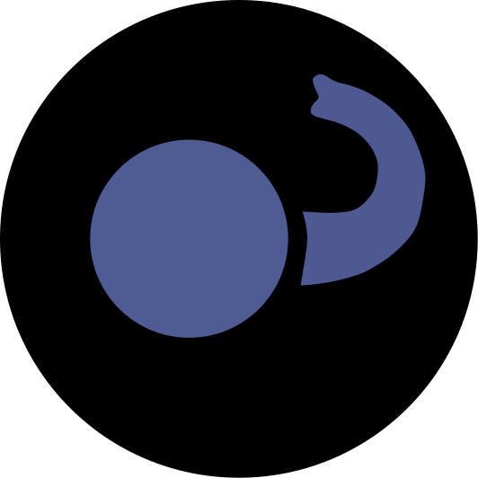

## DuckDB API for PHP

[](https://github.com/satur-io/duckdb-php/actions)
[](https://github.com/satur-io/duckdb-php/actions)
[](https://sonarcloud.io/summary/new_code?id=satur-io_duckdb-php)

This package provides a [DuckDB](https://github.com/duckdb/duckdb) Client API for PHP.

Focused on performance, it uses the official [C API](https://duckdb.org/docs/api/c/overview.html) internally through [FFI](https://www.php.net/manual/en/book.ffi.php) obtaining good benchmarks.
However, it is not just a wrapper for the C API and provides custom methods PHP flavored to work with DuckDB in a simple way.
It works on linux, windows and macOS with PHP versions greater than 8.2.

### Quick start

```php
$duckDB = DuckDB::create();

$result = $duckDB->query("SELECT 'quack' as my_column;");
$result->print();
```

```
-------------------
| my_column       |
-------------------
| quack           |
-------------------
```

> It's that simple! :duck:

Let's see how prepared statements work

#### Prepared statements
```php
$duckDB = DuckDB::create();

$duckDB->query( "CREATE TABLE test (i INTEGER, b BOOL, f FLOAT);");
$duckDB->query('INSERT INTO test VALUES (3, true, 1.1), (5, true, 1.2), (3, false, 1.1), (3, null, 1.2);');

$boolPreparedStatement = $duckDB->preparedStatement('SELECT * FROM test WHERE b = $1');
$boolPreparedStatement->bindParam(1, true);
$result = $boolPreparedStatement->execute();
$result->print();

$intPreparedStatement = $duckDB->preparedStatement('SELECT * FROM test WHERE i = ?');
$intPreparedStatement->bindParam(1, 3);
$result = $intPreparedStatement->execute();
$result->print();
```

> [!TIP]
> Do you want more use cases? Check the [examples folder](examples)


### Types support
| DuckDB type                | SQL type     | PHP type                      |           Read           |          Bind           |
|----------------------------|--------------|-------------------------------|:------------------------:|:-----------------------:|
| DUCKDB_TYPE_BOOLEAN        | BOOLEAN      | bool                          |    :white_check_mark:    |   :white_check_mark:    |
| DUCKDB_TYPE_TINYINT        | TINYINT      | int                           |    :white_check_mark:    |   :white_check_mark:    |
| DUCKDB_TYPE_SMALLINT       | SMALLINT     | int                           |    :white_check_mark:    |   :white_check_mark:    |
| DUCKDB_TYPE_INTEGER        | INTEGER      | int                           |    :white_check_mark:    |   :white_check_mark:    |
| DUCKDB_TYPE_BIGINT         | BIGINT       | int                           |    :white_check_mark:    |   :white_check_mark:    |
| DUCKDB_TYPE_UTINYINT       | UTINYINT     | int                           |    :white_check_mark:    |   :white_check_mark:    |
| DUCKDB_TYPE_USMALLINT      | USMALLINT    | int                           |    :white_check_mark:    |   :white_check_mark:    |
| DUCKDB_TYPE_UINTEGER       | UINTEGER     | int                           |    :white_check_mark:    |   :white_check_mark:    |
| DUCKDB_TYPE_UBIGINT        | UBIGINT      | string                        | :ballot_box_with_check:  | :ballot_box_with_check: |
| DUCKDB_TYPE_FLOAT          | FLOAT        | float                         |    :white_check_mark:    |   :white_check_mark:    |
| DUCKDB_TYPE_DOUBLE         | DOUBLE       | float                         |    :white_check_mark:    |   :white_check_mark:    |
| DUCKDB_TYPE_TIMESTAMP      | TIMESTAMP    | Saturio\DuckDB\Type\Timestamp |    :white_check_mark:    |     :grey_question:     |
| DUCKDB_TYPE_DATE           | DATE         | Saturio\DuckDB\Type\Date      |    :white_check_mark:    |     :grey_question:     |
| DUCKDB_TYPE_TIME           | TIME         | Saturio\DuckDB\Type\Time      |    :white_check_mark:    |     :grey_question:     |
| DUCKDB_TYPE_INTERVAL	      | INTERVAL     | Saturio\DuckDB\Type\Interval  |    :white_check_mark:    |     :grey_question:     |
| DUCKDB_TYPE_HUGEINT        | HUGEINT      | string                        | :ballot_box_with_check:  |     :grey_question:     |
| DUCKDB_TYPE_UHUGEINT       | UHUGEINT     | string                        | :ballot_box_with_check:  |     :grey_question:     |
| DUCKDB_TYPE_VARCHAR        | VARCHAR      | string                        |    :white_check_mark:    |     :grey_question:     |
| DUCKDB_TYPE_BLOB           | BLOB         |                               | :ballot_box_with_check:  |     :grey_question:     |
| DUCKDB_TYPE_TIMESTAMP_S    | TIMESTAMP_S  | Saturio\DuckDB\Type\Timestamp |    :white_check_mark:    |     :grey_question:     |
| DUCKDB_TYPE_TIMESTAMP_MS   | TIMESTAMP_MS | Saturio\DuckDB\Type\Timestamp |    :white_check_mark:    |     :grey_question:     |
| DUCKDB_TYPE_TIMESTAMP_NS   | TIMESTAMP_NS | Saturio\DuckDB\Type\Timestamp |    :white_check_mark:    |     :grey_question:     |
| DUCKDB_TYPE_UUID           | UUID         | Saturio\DuckDB\Type\UUID      |    :white_check_mark:    |     :grey_question:     |
| DUCKDB_TYPE_TIME_TZ        | TIMETZ       | Saturio\DuckDB\Type\Time      |    :white_check_mark:    |     :grey_question:     |
| DUCKDB_TYPE_TIMESTAMP_TZ   | TIMESTAMPTZ  | Saturio\DuckDB\Type\Timestamp |    :white_check_mark:    |     :grey_question:     |
| DUCKDB_TYPE_DECIMAL        | DECIMAL      | float                         |    :white_check_mark:    |     :grey_question:     |
| DUCKDB_TYPE_ENUM           | ENUM         | string                        |    :white_check_mark:    |  :small_blue_diamond:   |
| DUCKDB_TYPE_LIST           | LIST         | array                         |    :white_check_mark:    |  :small_blue_diamond:   |
| DUCKDB_TYPE_STRUCT         | STRUCT       | array                         |    :white_check_mark:    |  :small_blue_diamond:   |
| DUCKDB_TYPE_ARRAY          | ARRAY        | array                         |    :white_check_mark:    |  :small_blue_diamond:   |
| DUCKDB_TYPE_MAP            | MAP          | array                         |    :white_check_mark:    |  :small_blue_diamond:   |
| DUCKDB_TYPE_UNION          | UNION        | mixed                         |    :white_check_mark:    |  :small_blue_diamond:   |
| DUCKDB_TYPE_BIT            | BIT          | string                        |           :x:            |  :small_blue_diamond:   |

:white_check_mark: Fully supported

:ballot_box_with_check: Partially supported / Need improvements

:x: Not supported

:grey_question: Pending to check and cover with tests

:small_blue_diamond: Not applied
